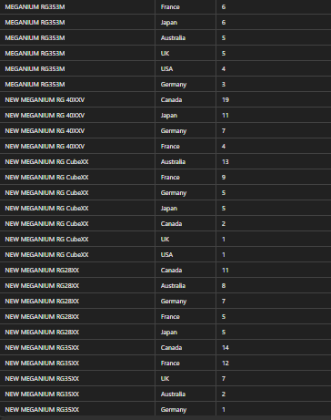
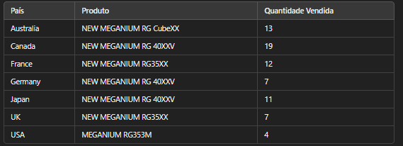
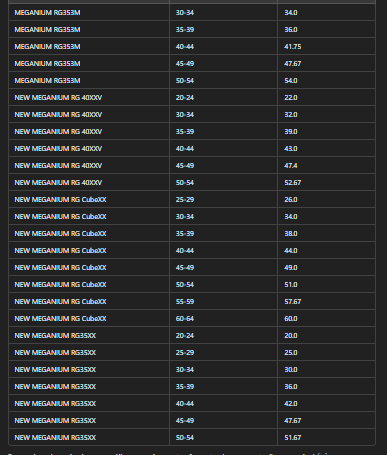
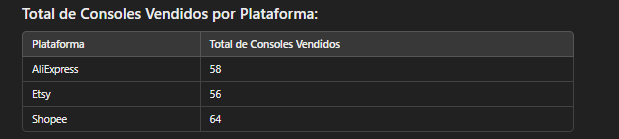
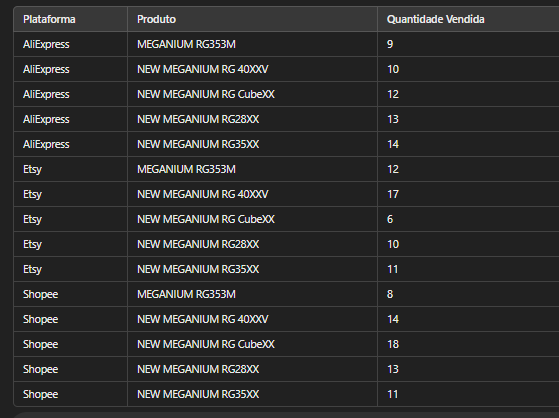
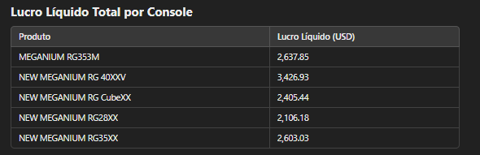
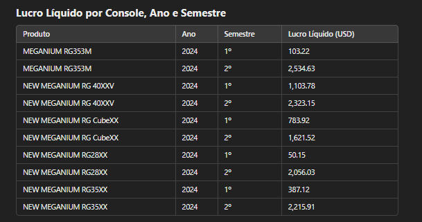

# Insights adquiridos

- Primeira pesquisa (resumo de vendas por países de cada produto)

- Segunda pesquisa (produto específico que tem a maior quantidade de venda de cada país)

- Terceira pesquisa (média de idade geral dos compradores dos produtos de acordo com o qual foi mais vendido no intervalo de 5 anos de idade)

- Quarta pesquisa

- Quinta pesquisa

